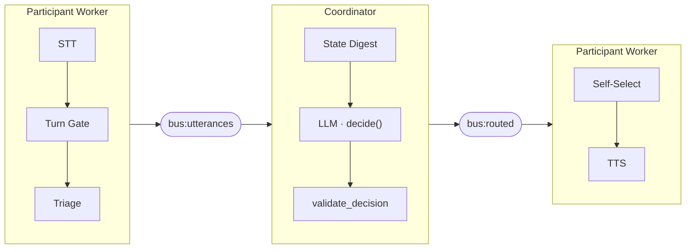
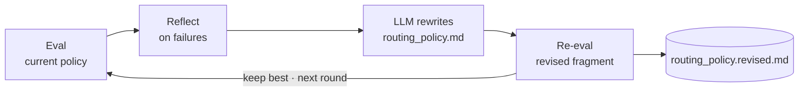

A coordination engine for N simultaneous voice channels. One AI coordinator decides, per utterance, which participants need to hear a derived message.

Some teams work over shared live audio yet cannot all monitor each other, such as a kitchen line, a pit crew, or an incident bridge. Coordinating them forces a tradeoff. A shared channel is simple but congests as members grow, because only one person transmits at a time and most traffic is irrelevant to any given listener, which is why radio systems add [talkgroups and segmented nets](https://en.wikipedia.org/wiki/Trunked_radio_system). Segmentation adds selectivity but stays static and content-blind. A human dispatcher is content-aware but throughput-limited, because a person tracks about [one speech stream at a time](https://en.wikipedia.org/wiki/Cocktail_party_effect) and incident-command doctrine puts the ideal [span of control](https://en.wikipedia.org/wiki/Incident_Command_System) at five (range three to seven). Current public-safety AI [assists that dispatcher](https://www.motorolasolutions.com/en_us/ai/assist.html) instead of owning the routing decision.

Knotch automates the routing role. A transport-less AI coordinator subscribes to every channel, holds shared state across all of them, and emits one addressed routing decision per utterance, combining the selectivity of segmentation with the content-awareness of a dispatcher. This inverts the common one-caller-to-many-bots assistant pattern such as [Vapi Squads](https://docs.vapi.ai/squads): many humans coordinated through one AI, not one caller handed between bots. Because Knotch is a decision layer and not transport, participant workers can run on infrastructure such as [LiveKit](https://docs.livekit.io/agents/).

The engine is domain-agnostic: a domain plugs in as a four-file data pack (roles, routing policy, evaluation rubric, and scenarios), and the repo ships a `_template` pack as the starting point rather than a built-in domain. The engine provides the routing loop, the fail-safe decision contract, the evaluation harness, and the self-improvement loop. Adding a domain requires no engine change.

Topologically this is hub-and-spoke, but the hub is content-aware: rather than relaying to every spoke, the coordinator decides who, if anyone, needs the message.



The coordinator makes one LLM call per utterance, the only LLM hop on the path. Output addressing is deterministic, with no second LLM call.

A few explicit design choices shape the system:
- **Held by default.** Routing optimizes for not speaking. Misroutes that interrupt a heads-down operator are the primary failure mode, so the rubric penalizes false positives (misroutes), not just missed routes.
- **Fail-safe contract.** `validate_decision` never raises and never trusts the LLM. Unknown recipients are dropped, the source is never a recipient, and malformed output becomes a held decision.
- **Domain-agnostic engine.** No domain literal appears anywhere under `engine/`. All domain knowledge lives in `domains/<name>/`. A CI test enforces this.
- **Single shared bus.** Each participant runs in its own process with its own transport. The coordinator is transport-less. Everything communicates over one pub/sub `Bus`, swappable between in-memory (development) and Redis (production) by env var.
- **Zone sharding seam.** Each coordinator owns one zone of roles and shares state over the bus, so roles partition across coordinator instances by design. The seam shards horizontally; it has not been load-tested at large scale.

## Quick start

Requires any OpenAI-compatible LLM endpoint (Ollama, Together, NIM, etc.):

```bash
pip install -e ".[dashboard,llm]"
cp .env.example .env   # set KNOTCH_LLM_URL and KNOTCH_LLM_MODEL
python3 -m engine --domain _template --all-scenarios --dashboard
# dashboard → http://localhost:7861
```

Runner flags: `--scenario <id>`, `--list-scenarios`, `--all-scenarios`, `--record run.jsonl`, `--dashboard`, `--dashboard-port`, `--step-delay`.

This single-process runner is the offline development and test harness: it replays scripted scenario text through fake STT, TTS, and transport so the routing engine, evaluation, and dashboard run with no audio stack and no API keys beyond the LLM. It is meant for development, testing, and inspecting routing behavior. It is not a user-facing deployment and carries no live audio. For live multi-party audio, see [Running with live audio](#running-with-live-audio).

## Domain packs

A pack is a directory under `domains/<name>/` with four files and no code:

| File | Purpose |
|---|---|
| `pack.yaml` | Domain id, display name, dispatcher voice, and the list of roles (`role_id`, `display_name`, `voice_id`, optional `zone_id`) |
| `routing_policy.md` | Routing policy fragment appended verbatim to the coordinator system prompt |
| `rubric.yaml` | Eval metrics layered on the base rubric (`prompts/base_rubric.yaml`) |
| `scenarios.yaml` | Scripted utterances with `expect` labels for evaluation and replay |

The engine treats `role_id` and `signal_type` as opaque strings. Name them whatever fits the domain. Create a new domain by copying the template:

```bash
cp -r domains/_template domains/myapp
# edit the four files
python3 -m engine --domain myapp --all-scenarios
```

Everything in `routing_policy.md` reaches the model verbatim, so keep it factual prose.

## Evaluation and self-improvement

**Evaluation** replays a pack's scenarios through an isolated `Coordinator` and scores each routing decision against the `expect` labels. It aggregates misroute rate, missed rate, and average time-to-action.

**Self-improvement** runs a closed loop over N rounds, keeping the best-scoring fragment. `--apply` overwrites the live `routing_policy.md`; a running coordinator process is not hot-swapped.



```bash
python3 -m engine.proc_improve --domain _template --rounds 3            # local scoring
python3 -m engine.proc_improve --domain _template --rounds 3 --apply    # overwrite routing_policy.md with the best
python3 -m engine.proc_improve --domain _template --rounds 3 --cekura   # Cekura judge as the score source
```

The rewrite step always calls the real LLM endpoint and requires `KNOTCH_LLM_URL`. The reflect step and scoring source are both replaceable extension points.

## Running with live audio

```bash
bash scripts/run_stack.sh    # Redis bus, coordinator, dashboard, Daily and Twilio participant workers
bash scripts/stop_stack.sh   # stop
```

This is the live-audio path. The participant workers under `.starter/server/` run real speech-to-text, text-to-speech, and transport, each participant as its own worker process connected to the others over the Redis bus. The bundled workers wire NVIDIA Parakeet (STT over WebSocket), Gradium (TTS), and Daily WebRTC / Twilio telephony (transport). These sit behind the `STTService`, `TTSService`, and `Transport` Protocols in `engine/interfaces.py`, so any provider that satisfies the interface can replace them. The coordinator, bus protocol, evaluation, and self-improvement loop are the same engine code as the offline harness. Configuring the relevant API keys and endpoints in `.env` is what turns the fakes into live audio.

## Configuration

Copy `.env.example` to `.env`.

| Variable | Default | Required | Purpose |
|---|---|---|---|
| `KNOTCH_BUS` | `memory` | No | `memory` (single-process) or `redis` (multi-host) |
| `REDIS_URL` | — | When `KNOTCH_BUS=redis` | Redis connection URL |
| `KNOTCH_LLM` | `nemotron` | No | Any OpenAI-compatible endpoint (`nemotron` backend selector) |
| `KNOTCH_LLM_URL` | — | When `KNOTCH_LLM=nemotron` | Routing endpoint URL |
| `KNOTCH_LLM_MODEL` | — | When `KNOTCH_LLM=nemotron` | Model name passed to the endpoint |

`KNOTCH_LLM=nemotron` selects the generic OpenAI-compatible adapter; the name is only a backend selector and works with any OpenAI-compatible endpoint set through `KNOTCH_LLM_URL`. Use `KNOTCH_LLM=fake` for fully offline runs with no endpoint.

See `.env.example` for the full set, including STT, TTS, transport, and turn-detection options used by the participant workers in `.starter/server/`.

## Project layout

```
engine/
  interfaces.py        bus channels, envelope types, payload dataclasses, service Protocols
  bus.py               InMemoryBus
  redis_bus.py         RedisBus (same Bus protocol)
  turn_detector.py     chunk accumulation and turn-stop detection
  triage.py            backchannel drop and coarse class tagging
  coordinator.py       routing loop: utterances to decision and state
  routing.py           validate_decision and self_select
  voice_worker.py      per-participant input and output loops
  eval_runner.py       scenario replay and scoring
  optimizer.py         eval, reflect, re-eval loop
  domain_loader.py     pack loader and system prompt assembly
  __main__.py          single-process runner (offline dev/test harness)
  proc_coordinator.py  coordinator as a standalone process
  proc_inject.py       scenario injector for distributed mode
  proc_improve.py      improvement loop as a process
  proc_curves.py       replay saved improvement curves to the dashboard
  dashboard/           read-only FastAPI and WebSocket bus subscriber (port 7861)
adapters/
  factory.py           env-driven service selection
  fake_*.py            offline adapters for STT, TTS, transport, LLM
  openai_llm.py        LLM adapter for any OpenAI-compatible endpoint
  cekura_score.py      Cekura-backed score source
domains/               pack directories (_template ships; others are local)
prompts/               routing scaffold and base rubric
.starter/server/       Pipecat participant workers, the live-audio path (Daily, Twilio, NVIDIA Parakeet STT, Gradium TTS)
tests/                 unit and contract tests
scripts/               stack management scripts
```

## Tests

```bash
python3 -m pytest
```

| Test | Covers |
|---|---|
| `tests/test_no_domain_strings.py` | The generality gate: no domain literal under `engine/` |
| `tests/test_routing_contract.py` | `validate_decision` contract and never-raise guarantee |
| `tests/test_bus.py` | `InMemoryBus` pub/sub lifecycle and `Envelope` round-trips |
| `tests/test_triage_gate.py` | Backchannel detection, triage classification, `SimpleTurnGate` |
| `tests/test_packloader.py` | Pack loading, validation, rubric merge |
| `tests/test_fake_llm.py` | Coordinator routing heuristic |

## Wire format

All bus traffic is `Envelope` objects (`engine/interfaces.py`) carrying a typed `payload` dict, serialized as JSON so the dashboard reads them verbatim. The payload dataclasses are the contract:

- `Utterance`: a turn-complete, triaged utterance from a participant.
- `RoutingDecision`: the coordinator's one output, with `source`, `recipients`, derived `message`, opaque `signal_type`, `urgency`, and `rationale`. Empty `recipients` means held.
- `StateUpdate`: a snapshot of the coordinator's shared state, broadcast to subscribers.
- `EvalScore`: a per-decision score from the eval runner.
- `TurnEvent`: an optional input-path signal for the dashboard.

The `Bus`, `Transport`, `STTService`, `TTSService`, and `CoordinatorLLM` protocols in `interfaces.py` are what every adapter implements, keeping backends swappable by env var.
